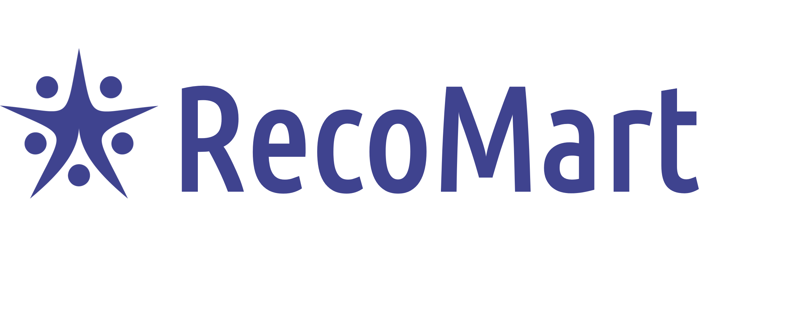
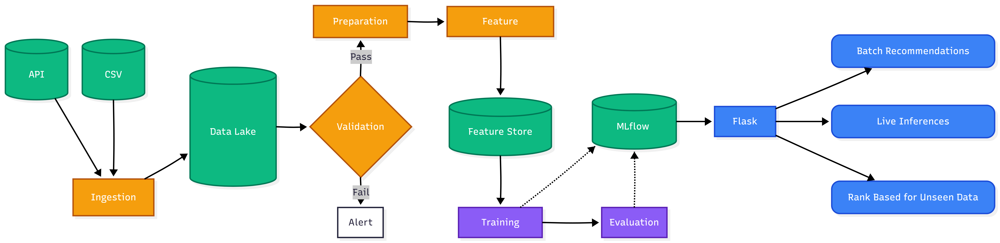

<p align="center">
  
</p>

# RecoMart End-to-End Recommendation Pipeline

<p align="center">
  
  
  
  
  
</p>

RecoMart is a production-grade e-commerce recommendation engine built on the Brazilian E-Commerce Public Dataset. It automates the full ML lifecycle—from data ingestion to real-time inference.

## 🏗️ Pipeline Architecture



The system identifies users with similar categorical purchase affinities using a **Memory-based User-User KNN** model.

1.  **Ingestion & Validation**: Automated data retrieval and schema/quality checks.
2.  **Feature Store**: Custom versioned store for point-in-time interaction features.
3.  **MLflow Tracking**: Model versioning, hyperparameter tuning, and metric logging.
4.  **Inference API**: High-performance Flask REST API for real-time recommendations.

## 🚀 Quick Start

### 1. Setup
```bash
pip install -r requirements.txt
./script_3_run_pipeline.ps1  # Runs full E2E pipeline
```

### 2. Monitoring & Serving
*   **MLflow Dashboard:** Run `mlflow ui` and visit `http://localhost:5000`
*   **Start API:** `python -m inference.inference_api --port 8000`

### 3. Example Request
```powershell
Invoke-RestMethod -Uri "http://127.0.0.1:8000/recommend-categories" -Method Post -ContentType "application/json" -Body '{"categories": ["bed_bath_table"], "n_items": 5}'
```

## 📖 Documentation
Detailed technical reports for each stage:
*   [Phase 1: Problem & Ingestion](docs/Task1_Problem_Formulation.md)
*   [Phase 2: Validation & Prep](docs/Task4_Data_Validation.md)
*   [Phase 3: Feature Engineering & Store](docs/Task7_Feature_Store.md)
*   [Phase 4: Model Training (MLflow)](docs/Task9_Model_Training_Prediction.md)

---
*Built for RecoMart e-commerce personalization.*

