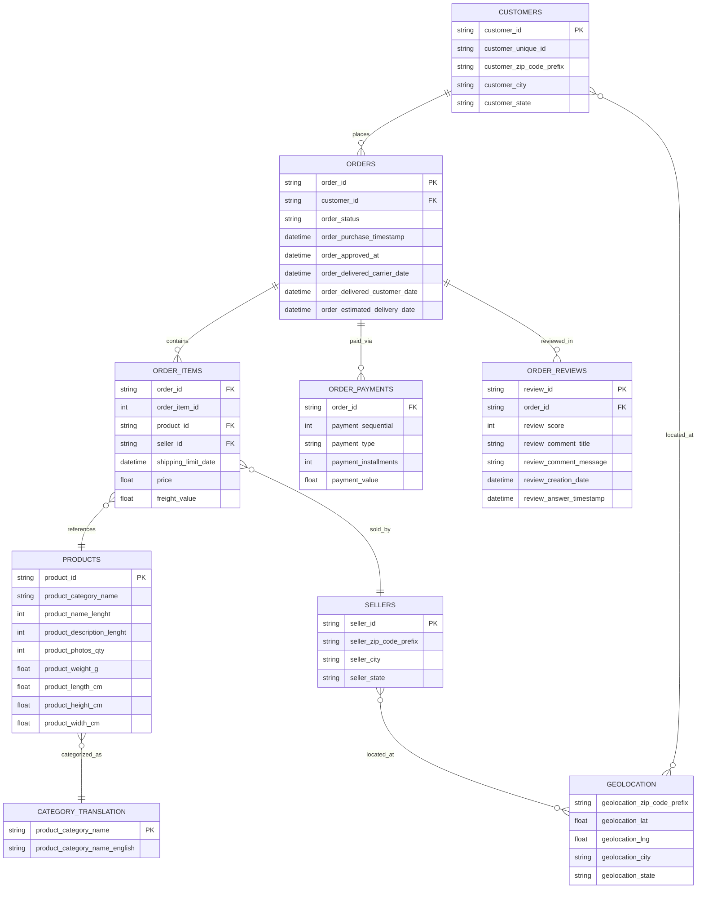
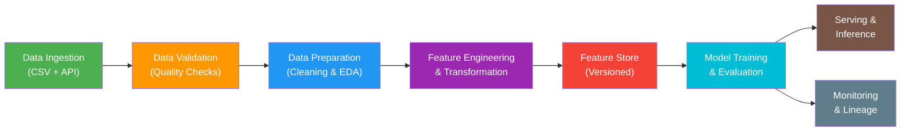

# Task 1: Problem Formulation Report

## RecoMart: End-to-End Data Management Pipeline for a Product Recommendation System

---

## 1. Problem Definition

### 1.1 Business Problem

**RecoMart** is an e-commerce marketplace that connects buyers with a network of sellers across diverse product categories. It generates sheer volume of data related to products, customers and sales.

**The core business problem** is to develop a **personalized product recommendation system** that surfaces the most relevant products to each customer. This system must:

- Improve the **conversion rate** by recommending products that align with individual purchase behavior and preferences.
- Enhance **customer engagement** through personalized shopping experiences.
- Increase **average order value (AOV)** by recommending complementary or higher-value items.
- Reduce **customer churn** by delivering timely and relevant product suggestions.

### 1.2 Objective

To design and implement a **complete, automated, and modular data pipeline** that ingests, validates, prepares, transforms, and serves data to a recommendation model. The pipeline will support both batch and near-real-time ingestion, ensuring the recommendation model always learns from fresh, validated, and well-structured data.

---

## 2. Data Sources and Their Attributes

The RecoMart dataset is an e-commerce dataset comprising **9 interrelated data files** that capture the full spectrum of marketplace transactions.

### 2.1 Data Source Summary

| # | Data Source                    | File Name                                 | Description                                  | Approx. Rows | Size     |
| - | ------------------------------ | ----------------------------------------- | -------------------------------------------- | ------------ | -------- |
| 1 | **Customers**            | `olist_customers_dataset.csv`           | Customer demographic and geographic info     | ~99,441      | ~9 MB    |
| 2 | **Products**             | `olist_products_dataset.csv`            | Product catalog with attributes              | ~32,951      | ~2.3 MB  |
| 3 | **Orders**               | `olist_orders_dataset.csv`              | Order-level transactions and status          | ~99,441      | ~17.6 MB |
| 4 | **Order Items**          | `olist_order_items_dataset.csv`         | Line-item details within each order          | ~112,650     | ~15.4 MB |
| 5 | **Order Reviews**        | `olist_order_reviews_dataset.csv`       | Customer reviews and ratings (1–5 scale)    | ~99,224      | ~14.5 MB |
| 6 | **Order Payments**       | `olist_order_payments_dataset.csv`      | Payment method and amount details            | ~103,886     | ~5.8 MB  |
| 7 | **Sellers**              | `olist_sellers_dataset.csv`             | Seller geographic and profile information    | ~3,095       | ~175 KB  |
| 8 | **Geolocation**          | `olist_geolocation_dataset.csv`         | Zip-code level latitude/longitude data       | ~1,000,163   | ~61.3 MB |
| 9 | **Category Translation** | `product_category_name_translation.csv` | Product category name translation (PT → EN) | ~71          | ~2.6 KB  |

### 2.2 Key Attributes by Data Source

#### 2.2.1 Customers Dataset

| Attribute                    | Description                                     |
| ---------------------------- | ----------------------------------------------- |
| `customer_id`              | Unique identifier for each customer (per order) |
| `customer_unique_id`       | De-duplicated unique customer identifier        |
| `customer_zip_code_prefix` | Customer's zip code prefix                      |
| `customer_city`            | Customer's city                                 |
| `customer_state`           | Customer's state                                |

#### 2.2.2 Products Dataset

| Attribute                      | Description                              |
| ------------------------------ | ---------------------------------------- |
| `product_id`                 | Unique product identifier                |
| `product_category_name`      | Product category (in Portuguese)         |
| `product_name_lenght`        | Length of the product name string        |
| `product_description_lenght` | Length of the product description string |
| `product_photos_qty`         | Number of product photos                 |
| `product_weight_g`           | Product weight in grams                  |
| `product_length_cm`          | Product length in centimeters            |
| `product_height_cm`          | Product height in centimeters            |
| `product_width_cm`           | Product width in centimeters             |

#### 2.2.3 Orders Dataset

| Attribute                         | Description                                |
| --------------------------------- | ------------------------------------------ |
| `order_id`                      | Unique order identifier                    |
| `customer_id`                   | Foreign key to the customer dataset        |
| `order_status`                  | Status: delivered, shipped, canceled, etc. |
| `order_purchase_timestamp`      | Purchase timestamp                         |
| `order_approved_at`             | Payment approval timestamp                 |
| `order_delivered_carrier_date`  | Carrier delivery timestamp                 |
| `order_delivered_customer_date` | Customer delivery timestamp                |
| `order_estimated_delivery_date` | Estimated delivery date                    |

#### 2.2.4 Order Items Dataset

| Attribute               | Description                             |
| ----------------------- | --------------------------------------- |
| `order_id`            | Foreign key to the orders dataset       |
| `order_item_id`       | Sequential item number within the order |
| `product_id`          | Foreign key to the products dataset     |
| `seller_id`           | Foreign key to the sellers dataset      |
| `shipping_limit_date` | Shipping deadline                       |
| `price`               | Item price                              |
| `freight_value`       | Freight/shipping cost                   |

#### 2.2.5 Order Reviews Dataset

| Attribute                   | Description                       |
| --------------------------- | --------------------------------- |
| `review_id`               | Unique review identifier          |
| `order_id`                | Foreign key to the orders dataset |
| `review_score`            | Rating score (1–5 scale)         |
| `review_comment_title`    | Review title text                 |
| `review_comment_message`  | Review body text                  |
| `review_creation_date`    | Review creation date              |
| `review_answer_timestamp` | Seller response timestamp         |

#### 2.2.6 Order Payments Dataset

| Attribute                | Description                                |
| ------------------------ | ------------------------------------------ |
| `order_id`             | Foreign key to the orders dataset          |
| `payment_sequential`   | Sequential payment number                  |
| `payment_type`         | Payment method (credit_card, boleto, etc.) |
| `payment_installments` | Number of installments                     |
| `payment_value`        | Transaction amount                         |

#### 2.2.7 Sellers Dataset

| Attribute                  | Description              |
| -------------------------- | ------------------------ |
| `seller_id`              | Unique seller identifier |
| `seller_zip_code_prefix` | Seller's zip code prefix |
| `seller_city`            | Seller's city            |
| `seller_state`           | Seller's state           |

#### 2.2.8 Geolocation Dataset

| Attribute                       | Description        |
| ------------------------------- | ------------------ |
| `geolocation_zip_code_prefix` | Zip code prefix    |
| `geolocation_lat`             | Latitude           |
| `geolocation_lng`             | Longitude          |
| `geolocation_city`            | City name          |
| `geolocation_state`           | State abbreviation |

#### 2.2.9 Product Category Name Translation

| Attribute                         | Description                 |
| --------------------------------- | --------------------------- |
| `product_category_name`         | Category name in Portuguese |
| `product_category_name_english` | Category name in English    |

### 2.3 Data Relationships (Entity-Relationship Model)



**Join Keys:**

- `customer_id` links Customers ↔ Orders
- `order_id` links Orders ↔ Order Items, Order Payments, Order Reviews
- `product_id` links Order Items ↔ Products
- `seller_id` links Order Items ↔ Sellers
- `zip_code_prefix` links Customers/Sellers ↔ Geolocation
- `product_category_name` links Products ↔ Category Translation

---

## 3. Expected Pipeline Outputs

The end-to-end data management pipeline is expected to produce the following outputs:

### 3.1 Clean Datasets for Exploratory Data Analysis (EDA)

| Output                                | Description                                                                                                     |
| ------------------------------------- | --------------------------------------------------------------------------------------------------------------- |
| **Cleaned Customer Dataset**    | De-duplicated, with standardized city/state names, missing values handled                                       |
| **Cleaned Product Dataset**     | Category names translated to English, missing dimensions/weights imputed or flagged                             |
| **Cleaned Transaction Dataset** | Merged orders + order items + reviews + payments; filtered for delivered orders only                            |
| **Interaction Matrix**          | A user-item interaction matrix mapping `customer_unique_id` → `product_id` with implicit/explicit ratings  |
| **EDA Summary Plots**           | Distributions of review scores, item popularity, user activity, category breakdowns, temporal purchase patterns |

### 3.2 Engineered Features for Recommendation Models

| Feature Category                 | Example Features                                                                                         |
| -------------------------------- | -------------------------------------------------------------------------------------------------------- |
| **User Features**          | Purchase frequency, average rating given, preferred categories, total spending, recency of last purchase |
| **Item Features**          | Average rating received, total units sold, price level, category, number of reviews                      |
| **User-Item Interaction**  | User's rating for each item, purchase count per user-item pair                                           |
| **Co-occurrence Features** | Items frequently bought together, category co-occurrence                                                 |
| **Temporal Features**      | Day-of-week/hour purchase patterns, time between repeat purchases                                        |
| **Geographic Features**    | User-seller distance, regional purchase preferences                                                      |

### 3.3 Deployable Recommendation Model and Inference Interface

| Component                               | Description                                                                     | Implementation                                     |
| --------------------------------------- | ------------------------------------------------------------------------------- | -------------------------------------------------- |
| **Collaborative Filtering Model** | Memory-based Category User-User KNN trained on user-category interactions       | `models/model_training.py` using scikit-learn    |
| **Model Artifacts**               | Serialized model files (.pkl / .joblib) versioned and stored                    | MLflow-tracked artifacts in `mlruns/`            |
| **REST API Inference Service**    | Flask-based API endpoint that accepts user ID and returns top-K recommendations | `inference/inference_api.py` (see section 3.3.1) |
| **Feature Store Integration**     | Online and batch serving of features via feature store                          | `feature_store/feature_store_manager.py`         |
| **Model Metadata**                | MLflow-tracked experiment runs including parameters, metrics, and artifacts     | Tracked in MLflow UI                               |

#### 3.3.1 Inference API Specification

The inference service is a deployable Flask REST API providing:

**Endpoint: POST `/recommend`** - Single-user recommendations

```json
Request: {
  "user_id": "user_unique_id",
  "n_items": 10,
  "exclude_items": ["previously_seen_item_1"]
}

Response: {
  "user_id": "user_unique_id",
  "recommendations": [
    {"item_id": "product_id", "score": 0.85, "rank": 1},
    {"item_id": "product_id", "score": 0.82, "rank": 2},
    ...
  ],
  "count": 10,
  "timestamp": "2026-04-10T14:30:00"
}
```

**Endpoint: POST `/recommend-batch`** - Batch recommendations

```json
Request: {
  "user_ids": ["user1", "user2", "user3"],
  "n_items": 10
}

Response: {
  "recommendations": {
    "user1": [...],
    "user2": [...],
    ...
  },
  "user_count": 3,
  "timestamp": "2026-04-10T14:30:00"
}
```

**Endpoint: GET `/health`** - Health check for production monitoring

**Endpoint: GET `/model-info`** - Model and API documentation

To deploy the inference API:

```bash
python -m inference.inference_api --port 8000 --host 0.0.0.0
```

---

## 4. Evaluation Metrics

The following evaluation metrics will be used to assess the quality of the recommendation system:

### 4.1 Ranking Evaluation Metrics (Primary)

These metrics evaluate how well the recommendation system ranks items for each user:

| Metric                                                   | Formula / Description                                | Purpose                                                                                                             | Computation                                  |
| -------------------------------------------------------- | ---------------------------------------------------- | ------------------------------------------------------------------------------------------------------------------- | -------------------------------------------- |
| **Precision@K**                                    | (# Relevant items in top K) / K                      | Measures the proportion of recommended items that are actually relevant to the user                                 | Computed in `models/evaluation_metrics.py` |
| **Recall@K**                                       | (# Relevant items in top K) / (Total relevant items) | Measures the proportion of all relevant items that appear in the top-K recommendations                              | Computed in `models/evaluation_metrics.py` |
| **NDCG@K** (Normalized Discounted Cumulative Gain) | DCG@K / iDCG@K where DCG = Σ(rel_i / log₂(i+1))    | Evaluates ranking quality by giving more weight to relevant items appearing at higher positions; ranges from 0 to 1 | Computed in `models/evaluation_metrics.py` |

### 4.2 Rating Prediction Metrics (Deprecated)

*Note: RMSE and MAE are no longer used as the system has transitioned entirely to implicit categorical intent prediction rather than explicit 1-5 star rating prediction.*

### 4.3 Evaluation Approach

- **Test Set Split**: 80/20 train-test split with temporal ordering respected
- **Relevance Definition**: Items rated ≥ 4 (on 1-5 scale) are considered relevant
- **K Values Evaluated**: **K ∈ {5, 10, 20}** to assess recommendations at different list lengths
  - K=5: High-precision top recommendations
  - K=10: Balanced coverage and precision
  - K=20: Broader catalog coverage evaluation

### 4.4 Per-User Aggregation

Metrics are computed per-user, then aggregated using mean and standard deviation to understand both average performance and consistency:

```
Mean Precision@10 = Σ(Precision@10 for user i) / # users
Std Precision@10 = std(Precision@10 for all users)
```

---

## 5. Pipeline Architecture Overview

The end-to-end data pipeline will follow this high-level architecture:



### Pipeline Stages:

1. **Data Collection and Ingestion**: Batch ingestion from CSV files + REST API (simulated) with automated scheduling, error handling, and logging.
2. **Raw Data Storage**: Structured data lake with partitioning by source, type, and timestamp.
3. **Data Profiling and Validation**: Schema checks, missing value detection, duplicate removal, range validation (e.g., review_score ∈ [1,5]).
4. **Data Preparation**: Cleaning, encoding categorical variables, normalizing numerical features, handling missing interactions.
5. **Feature Engineering and Transformation**: User/item aggregate features, co-occurrence matrices, temporal features.
6. **Feature Store**: Centralized feature registry with versioning (using Feast or custom implementation).
7. **Model Training**: Memory-based Category User-User KNN collaborative filtering with MLflow tracking.
8. **Pipeline Orchestration**: Automated DAGs using Apache Airflow / Prefect / Dagster.
9. **Data Versioning & Lineage**: DVC or Git LFS for dataset versioning; metadata tracking for lineage.

---

## 6. Key Assumptions and Constraints

| # | Assumption / Constraint                                                                                              |
| - | -------------------------------------------------------------------------------------------------------------------- |
| 1 | The dataset represents a Brazilian e-commerce marketplace adapted for the RecoMart context                           |
| 2 | Review scores (1–5) serve as**explicit feedback** for collaborative filtering                                 |
| 3 | Purchase interactions serve as**implicit feedback** (binary: purchased/not purchased)                          |
| 4 | Only**delivered** orders will be used for model training (filtering out canceled/unavailable orders)           |
| 5 | Product categories will be translated from Portuguese to English using the provided translation table                |
| 6 | Geolocation data will be used for geographic feature engineering (user-seller distance)                              |
| 7 | The pipeline must be modular and extensible to accommodate future data sources (e.g., clickstream data, search logs) |
| 8 | Near-real-time ingestion is simulated using periodic batch fetching with configurable intervals                      |

---

## 7. Success Criteria

| Criteria                                                                | Target                      |
| ----------------------------------------------------------------------- | --------------------------- |
| Pipeline executes end-to-end without manual intervention                | Automated via orchestration |
| Data quality checks pass with > 95% completeness                        | Validated at ingestion      |
| Recommendation model achieves Precision@10 > 0.05 (cold-start baseline) | Evaluated post-training     |
| NDCG@10 improves over random baseline by > 50%                          | Compared to random          |
| All pipeline stages are logged, monitored, and reproducible             | Orchestration + versioning  |
| Feature store supports versioned retrieval for train/inference          | Feast or custom             |

---

## 8. Conclusion

This report defines the problem formulation for RecoMart's **end-to-end data management pipeline for a product recommendation system**. The dataset comprises 9 interconnected sources covering customers, products, orders, items, reviews, payments, sellers, and geolocation - providing a rich foundation for building both collaborative and content-based recommendation models.

The pipeline will be designed as a modular, automated system that ensures data freshness, quality, and structural integrity at every stage - from ingestion through to model serving and evaluation.

---
